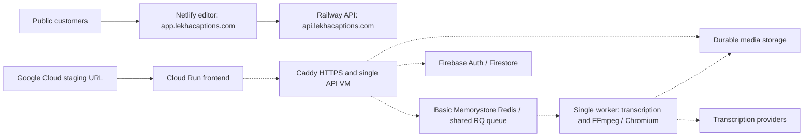

# Lekha Captions: critical Google Cloud launch audit

**Historical initial audit:** authentication was subsequently completed and critical fixes were deployed. See [11 September deployment result](GCP_DEPLOYMENT_2026-09-11.md) for current release, infrastructure changes, verification and remaining launch gates.

Inspection date: 9 September 2026. Scope: critical fixes and a fast evidence-based audit, not a completed infrastructure migration. Local changes below have NOT been deployed.

## 1. Executive verdict

**RED — NOT READY FOR PUBLIC LAUNCH at the requested mass-user/five-minute-export level.**

The public service responds, but the Google Cloud migration has not reached the public domains. DNS still sends the editor to Netlify and the API to Railway. A separate Google Cloud staging frontend and API respond successfully. A healthy endpoint does not prove mass rendering capacity.

The installed gcloud CLI has no authenticated account or selected project. Live resource inspection and changes were therefore blocked. Existing records describe one API VM, one worker, Basic Redis, test payments and incomplete alert routing. These are serious launch concerns that need live confirmation and resolution. No autoscaling setting was changed remotely.

## 2. Architecture discovered

Solid arrows below are verified public routing; dotted arrows describe repository/deployment evidence, not a fresh authenticated resource inventory.

| Identity | Evidence |
|---|---|
| Active cloud account | None: gcloud auth list returned an empty list |
| Active project | None configured |
| Recorded GCP project | project-0cc7c839-b9c7-4734-ad0 |
| Recorded project number / region | 602676673096 / asia-south1; not authenticated today |
| Public marketing / editor / API release | 838b28c8e10ee402fa1c1716418302a991cfee1f; all three public markers checked today |
| GCP staging frontend / API release | 5b37a0f708b27d6fcdd575026c4a108147b3f72b; both checked today |
| Current local HEAD | 6e16fce04fb8a9271438a973bd07d8d121153751, plus uncommitted fixes |
| Current worker release | Not directly verified today; yesterday's report records 5b37a0f... for GCP |

The code supports Firebase Storage and an S3-compatible backend. S3 configuration can override Firebase storage. The actual active bucket, provider, permissions and locality require authenticated inspection.

| Recorded GCP resource | Size / configuration from repository | Readiness for mass launch |
|---|---|---|
| lekha-frontend-staging | Cloud Run; recorded max 20, concurrency 80; recipe min 0, 1 CPU, 512 MiB | YELLOW: public endpoint works, live limits not re-read |
| lekha-api-staging | One VM; recipe e2-standard-4, 4 vCPU/16 GiB, 100 GiB disk; two Uvicorn processes | RED: single-instance architecture, proxied uploads, no verified autoscaling |
| lekha-worker-staging | One VM; same recipe; one serial RQ worker | RED: shared transcription/render capacity, no verified scaling |
| lekha-redis-staging | September 8 report: Basic tier, no replica/failover/persistence/transport encryption | RED: critical queue single point of failure |
| Firestore, storage, IAM, quotas, backups | Live configuration unavailable | UNVERIFIED |

VM machine types above are provisioning instructions, not measurements of current machines. Current utilization, disk use, active instances and regional quotas were unavailable.

## 3. What was already configured correctly

Repository implementation includes durable RQ exports; server-side export receipts; one active export per account; atomic Redis transitions and rate admission; bounded retry delays; unique worker identities; cancellation checks; durable transcription intent/outbox; signed media access; server-enforced ownership; payment signatures and idempotency; upload size/format safeguards; scratch cleanup; and production guards against insecure development fallbacks.

Firestore client rules limit reads to owners and deny client account/payment mutations. Storage client rules deny direct access. These are code findings; deployed rules were not retrieved today. Earlier production acceptance and payment records remain useful historical evidence, not proof for this GCP release.

## 4. Problems discovered

| Severity | Problem | User impact | Fix / status |
|---|---|---|---|
| P1 | Public DNS still uses Netlify/Railway | GCP changes do not affect normal customer traffic | Verified; cutover must follow GCP acceptance, no DNS change made |
| P1 | Single API and shared serial worker in recorded GCP setup | Exports wait behind each other; transcription can be delayed; instance failure interrupts service | Needs live verification and bounded capacity/redundancy implementation |
| P1 | Missing export queue allowed API-local rendering | Expensive work could overload the API | Fixed locally: production startup fails; request boundary returns retryable 503 |
| P1 | Export timing restarted inside renderer; SLO read enqueue latency | Long waits could appear as fast exports | Fixed locally: admission-to-completion timing, preserved across retries; SLO uses completion samples |
| P1 | Historical SLO failure made readiness fail | A render slowdown could remove healthy API replicas from service | Fixed locally: dependency readiness remains separate from release/SLO evaluation |
| P1 | Deployment force-removed app container | Active jobs could be killed during normal replacement | Script now requests graceful stop before removing app or restarting scanner |
| P1 | Basic Redis and unverified eviction/recovery policy | Queue loss or outage risk | Migration/failover/recovery plan required; not changed blindly |
| P1 | GCP report records Razorpay test mode and no confirmed alert channel | Live payment acceptance and incident notification not established | Verify runtime mode and test routing after sign-in |
| P1 | Global media capacity and bounded admission not proven | Large export/upload storm can exceed capacity | Stage realistic tests; implement measured worker limits and safe backpressure |
| P1 | Production build configuration unavailable locally | Cannot build a verified deployable release here | Required API/App Check/legal environment must be supplied by deployment configuration |
| P2 | Time-based UI claimed finalizing / a two-minute duration | Misleading progress during delays | Fixed locally: server-driven phase copy, explicit retry state, no unsupported time promise |

## 5. Changes made and verification

| Before | After | Why | Verification |
|---|---|---|---|
| Queue setup could fail into synchronous API render path | Startup guard plus 503 and Retry-After at export boundary | Protect normal API work | Regression asserts no renderer or user-slot claim runs |
| Render start reset the timer | Original admission time survives retries; initial pre-render wait preserved | Measure real user latency | Simulated 180-second wait and retry preserve original timestamps |
| Export SLO used short HTTP enqueue time | Uses persisted completed-export durations | Avoid false capacity claims | Regression: 10 ms enqueue does not hide 360,000 ms completion |
| Slow historical exports could make healthy API unready | Dependency failure still gives 503; healthy dependencies give 200 independently of SLO | Avoid a load-related availability cascade | Separate healthy-slow and unhealthy-dependency tests |
| docker rm -f replaced the app | docker stop --time 1860, then normal remove; configured stop timeout | Allow RQ's 30-minute job limit plus cleanup during routine replacement | Bash syntax validated; actual Docker drain not executable here |
| Timer overwrote phases / claimed two minutes | Server phase messages and retry state; neutral “Preparing your export” | Honest progress without queue position | Frontend contracts, lint and type checking |

This deployment script still replaces a single VM's app in place. It is not a rolling zero-downtime deployment, and its stop allowance is not a protection against VM deletion or a zonal outage. A managed worker fleet needs its own in-flight-job-safe scale-in design.

## 6. Autoscaling report

| Component | Current verified status | Recorded configuration |
|---|---|---|
| GCP frontend | UNVERIFIED live limits | ON in September 8 report: max 20, concurrency 80 |
| GCP API | UNVERIFIED live configuration | OFF in recorded architecture: single unmanaged VM |
| Export workers | UNVERIFIED live configuration | OFF in recorded architecture: one RQ worker VM |
| Transcription workers | UNVERIFIED live configuration | Same queue/worker as exports; no separate pool |
| Redis | UNVERIFIED live configuration | No automatic capacity scaling/failover in recorded Basic deployment |
| Firestore | UNVERIFIED project settings | Managed service; application limits/indexes/access patterns still matter |

There is no safe universal “turn on autoscaling” switch for the two VMs. Worker metrics, a managed fleet, quotas, rollout and shutdown handling are prerequisites. Raising Cloud Run frontend limits would not increase FFmpeg capacity. Google documents [queue/work-based custom-metric autoscaling](https://docs.cloud.google.com/compute/docs/autoscaler/scaling-cloud-monitoring-metrics).

## 7. Export storm result

| Simultaneous exports | Live queue/render time | Errors / workers / CPU / RAM |
|---:|---|---|
| 10 | Not run | Not measured |
| 25 | Not run | Not measured |
| 50 | Not run | Not measured |
| 100 | Not run | Not measured |
| 250 | Not run | Not measured |

No disposable authenticated GCP media session or isolated load environment was supplied. No production stress test or paid provider flood was launched. Local regression tests do not substitute for these runs. Existing media smoke tools assume a synchronous transcription result and must support the current asynchronous response before they can establish a reliable journey benchmark.

## 8. Test results

- Backend: 163 tests passed after the critical changes, including queue/state, tenant isolation, payments, transcription outbox, media boundaries and mock smoke flows. Tests use local substitutes for cloud dependencies.
- Frontend: API/editor/export/recovery/release contract checks, lint and TypeScript checks passed.
- Production build: BLOCKED. First missing VITE_API_BASE_URL; with the verified GCP API supplied, missing VITE_FIREBASE_APP_CHECK_SITE_KEY. Production also requires actual legal identity fields. No guards were removed to make a release pass.
- Separate test-mode compilation passed in 20.61 seconds; it is not a production-configured artifact. After the final retry-timing refinement, all 37 focused production-boundary tests passed again.
- GCE startup script: Bash syntax passed. Docker is unavailable, so container build and real drain tests were not run.
- Current public checks: seven small HTTPS GETs succeeded, including both API readiness endpoints and all five release markers. Public API readiness took about 1.20 s and GCP API readiness about 0.19 s in this single sample; these are not capacity or global latency measurements.
- Historical September 8 record: frontend 300/300 lightweight requests, concurrency 30, p95 91 ms; API health 200/200, concurrency 25, p95 181 ms. Not rerun and not representative of media work.

Python's initial TLS validation reported an expired certificate on several domains. Windows curl then verified HTTPS successfully without bypassing certificates. This inconsistency is not sufficient evidence of an expired production certificate; no TLS verification was disabled.

## 9. Maximum practical current capacity

Unknown. No defensible estimate for 1,000, 5,000 or 10,000 concurrent users is available. Visitor counts do not determine render throughput; exports per minute, job cost, media size and API usage do.

Illustration only: if one job occupies a worker for 60 seconds and one worker serves 250 simultaneous jobs, the last finishes after about 250 minutes. With already-warm identical workers, no failures and no transfer overhead, 50 workers could theoretically process five waves within 300 seconds. This is arithmetic, not a benchmark or a proposed fleet size. Real overhead and startup time require headroom, and an individual render exceeding 300 seconds cannot meet the target simply by adding workers.

## 10. Likely first bottleneck

Based on the recorded architecture, the shared serial worker is the immediate export/transcription bottleneck. The API VM is another risk because large uploads pass through it; media retrieval can also involve API-local files and remote fetches. Raising API process count alone does not solve either.

## 11. Google Cloud quota risks

Current regional CPU, disk, IP, instance, Cloud Run, provider and database quotas were not retrievable. Compare measured peak worker/API resources against quotas before enabling a fleet. No quota values or approvals are assumed.

## 12. Security verdict

Local tests verify relevant authorization and idempotency boundaries. No new catastrophic security defect was demonstrated in this pass. Live IAM, firewall exposure, bucket public access, deployed rules/App Check, secret access and provider configuration remain unverified. The historical Redis transport/HA findings require review; do not expose Redis publicly or migrate customer queue data blindly.

## 13. Reliability verdict

Application-level duplicate delivery/cancellation handling exists. Unexpected worker failure may become a visible failed export requiring retry; universal automatic recovery was not established. The recorded single VM and Basic Redis architecture lacks the redundancy needed for the requested launch. Standard Redis offers cross-zone replication/failover, but changing tiers or endpoints requires a tested migration and recovery procedure. See [Google's HA documentation](https://docs.cloud.google.com/memorystore/docs/redis/high-availability-for-memorystore-for-redis).

## 14. Monitoring and alerts

The September 8 report records 60-second frontend/API uptime checks and two-minute outage policies, but no confirmed notification channel and no Sentry configuration. No new notification was sent or live alert changed. Export completion samples are stored in the application's operational metrics; these are not a newly configured Google Cloud autoscaling metric or alert. Necessary live signals include oldest queued job, missing workers, job/deadline failures, Redis memory and disk pressure, plus verified delivery to an operator.

## 15. Scaling cost

No credible monetary estimate is possible without live billing, actual machine types, quotas and a measured workload. Existing setup notes mention INR 5,000/month budget alerts; an alert is not a spending cap. API redundancy and a warm worker fleet increase baseline cost; burst workers, transcription calls, storage and network transfer increase variable cost. Obtain a workload-based estimate before increasing ongoing spend materially.

## 16. Critical remaining work

1. Sign into gcloud and confirm the production project. Retrieve live configuration, including the resource and payment/alert findings above.
2. Implement bounded API redundancy/scaling and a worker fleet with measured queue-based scaling and safe draining. Isolate transcription capacity; retain fair per-account limits and add measured global admission control.
3. Resolve Redis HA/recovery and eviction policy with a migration plan. Google's [memory management guidance](https://docs.cloud.google.com/memorystore/docs/redis/memory-management-best-practices) explains how eviction affects capacity.
4. Confirm payments, actual storage, rules/App Check, alert delivery, backup restore and quotas in the GCP environment.
5. Supply real build configuration, package these local changes into one immutable release, build the container and run authenticated GCP acceptance plus bounded real-media load/failure tests.
6. Only then perform a documented production cutover and rollback verification. Re-check every public frontend/API/worker release.

## 17. Important commands executed

Read-only cloud attempts: gcloud config list --format=json; gcloud auth list --filter=status:ACTIVE --format=json; gcloud projects describe project-0cc7c839-b9c7-4734-ad0; gcloud compute instances list; gcloud run services list. Resource queries failed for lack of an active account.

Public verification: Resolve-DnsName for app/api domains; curl.exe HTTPS GETs for readiness and release markers, with normal certificate verification.

Local validation: python -m unittest discover -s backend/tests -q; npm run ci:frontend; npm run build:guarded with the known GCP API URL; separate Vite test-mode compile; Git Bash -n deploy/gcp/gce-startup.sh; git diff --check. No production mutation command was executed.

## 18. Files changed

- backend/main.py
- backend/tests/test_production_boundaries.py
- src/components/dashboard/ExportPanel.jsx
- deploy/gcp/gce-startup.sh (already an untracked file when this task began)
- docs/GCP_LAUNCH_AUDIT_2026-09-09.md
- docs/GCP_DEPLOYMENT_PROMPT.md

Other pre-existing README, deployment and landing-page changes were preserved. Local evidence lives in the outer workspace's output directory: gcp-audit-public-evidence.json, gcp-audit-backend-tests.log, gcp-audit-frontend-checks.log, gcp-audit-build.log and gcp-audit-compile.log. The test-mode compile output is also there and must not be deployed as production.

## 19. Deployment verification

| URL / component | Today's result |
|---|---|
| https://lekhacaptions.com/release.json | HTTP 200; 838b28c... |
| https://app.lekhacaptions.com/release.json | HTTP 200; 838b28c...; DNS Netlify |
| https://api.lekhacaptions.com/api/version | HTTP 200; 838b28c...; DNS/server Railway |
| https://api.lekhacaptions.com/api/health/readiness | HTTP 200; ready true |
| https://34-93-113-193.sslip.io/api/version | HTTP 200; 5b37a0f... |
| https://34-93-113-193.sslip.io/api/health/readiness | HTTP 200; ready true |
| https://lekha-frontend-staging-602676673096.asia-south1.run.app/release.json | HTTP 200; 5b37a0f... |
| Worker | No direct live verification today |

## 20. Final launch checklist

PASS means verified within the stated scope; WARNING means missing or historical evidence, not approval.

| Gate | Result |
|---|---|
| Public frontend/API responding and release markers readable | PASS |
| GCP frontend/API responding and matching each other | PASS |
| Public migration to GCP complete | FAIL |
| Critical local backend tests | PASS |
| Frontend contracts/lint/typecheck | PASS |
| Production-configured build and container build | FAIL / blocked |
| Fixes deployed and worker release matched | FAIL / not deployed |
| API and render-worker autoscaling verified | WARNING |
| Five-minute completion at defined peak load | FAIL / not established |
| 10/25/50/100/250 real export bursts | WARNING / not run |
| Redis HA, eviction and recovery verified | WARNING |
| Storage, Firestore, auth/App Check and cross-user isolation live-tested on GCP | WARNING |
| Payment mode and webhook lifecycle live-tested on GCP | WARNING |
| Alerts delivered, quota/billing controls checked | WARNING |
| Current backup restore and drain/rollback drill | WARNING |

Reusable follow-up instructions: [GCP_DEPLOYMENT_PROMPT.md](GCP_DEPLOYMENT_PROMPT.md).
